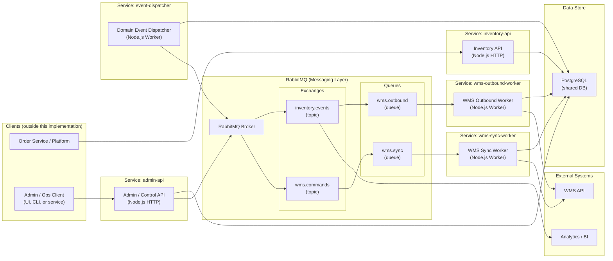

# Nabis Inventory Service Architecture - Production-Grade (API-First, Explicit Messaging, Microservices)

Node.js + PostgreSQL + RabbitMQ

## 1. Overview

This document describes a **production-grade, API-first, microservice-oriented** architecture for the Nabis Inventory Service that:

- Maintains **authoritative, real-time available inventory** for the Nabis platform.
- Integrates with a **rate-limited, batch-oriented WMS** without ever putting WMS in the order hot path.
- Prevents **overselling** even under high concurrency.
- Exposes **middleware APIs only** (no UI); any UI or back-office tool can consume these APIs.
- Uses **Node.js**, **PostgreSQL** as the system of record, and **RabbitMQ** as an explicit messaging backbone.
- Clearly separates concerns into **distinct services/processes** (Inventory API, Admin API, Event Dispatcher, WMS Outbound Worker, WMS Sync Worker).

Core principles:

- **Postgres is the source of truth** for inventory state.
- **Orders only hit the Inventory API + Postgres**, never WMS or RabbitMQ directly for correctness.
- **RabbitMQ** is a first-class component, with concrete queues/exchanges wired to workers.
- **Outbox pattern** guarantees that inventory changes and the events describing them are committed atomically.
- **Microservices, not monolith**: each service can be deployed, scaled, and owned independently, while sharing the same DB and messaging layer as needed.

We treat inventory like a banking system treats balances:

- Append-only **ledger** of movements.
- Snapshot **available_quantity** for fast reads.
- **Reconciliation & adjustment** with WMS via async workers.

---

## 2. High-Level Architecture

### 2.1 Services & Components

**Service 1: Inventory API Service (`inventory-api`)**

- Node.js HTTP service.
- Endpoints:
     - `POST /inventory/reserve`
     - `POST /inventory/release`
     - `GET /inventory/:sku`
- Responsibilities:
     - Order-time inventory validation and reservation.
     - Row-level locking and updates to `available_quantity` and ledger.
     - Emitting domain events into the outbox (`domain_event` table).
- Talks to:
     - PostgreSQL (read/write).

**Service 2: Admin / Control API Service (`admin-api`)**

- Node.js HTTP service.
- Endpoints:
     - `POST /admin/wms/sync`.
- Responsibilities:
     - Expose a control-plane API for operations/automation.
     - Record `wms_sync_request` rows in Postgres.
     - Publish `ForceWmsSync` commands to RabbitMQ.
- Talks to:
     - PostgreSQL (read/write).
     - RabbitMQ (`wms.commands` exchange).

**Service 3: Domain Event Dispatcher Service (`event-dispatcher`)**

- Node.js worker service (no HTTP).
- Responsibilities:
     - Poll `domain_event` table in Postgres.
     - Publish pending domain events to RabbitMQ `inventory.events` exchange.
     - Mark events as `SENT` or `FAILED`.
- Talks to:
     - PostgreSQL (read/write).
     - RabbitMQ (`inventory.events` exchange).

**Service 4: WMS Outbound Worker Service (`wms-outbound-worker`)**

- Node.js worker service (no HTTP).
- Responsibilities:
     - Consume messages from RabbitMQ queue `wms.outbound`.
     - Call WMS API to allocate/release inventory based on events.
     - Optionally record WMS call results in Postgres for audit/observability.
- Talks to:
     - RabbitMQ (`wms.outbound` queue).
     - WMS API.
     - PostgreSQL (optional read/write).

**Service 5: WMS Sync Worker Service (`wms-sync-worker`)**

- Node.js worker service (no HTTP).
- Responsibilities:
     - Consume commands from RabbitMQ queue `wms.sync` (e.g., `ForceWmsSync`).
     - Call WMS API to retrieve inventory snapshots.
     - Write `wms_inventory_snapshot` and corresponding adjustments into Postgres.
- Talks to:
     - RabbitMQ (`wms.sync` queue).
     - WMS API.
     - PostgreSQL (read/write).

**Shared Infrastructure:**

- **RabbitMQ**
     - Exchange: `inventory.events` (topic) - domain events (InventoryAllocated, etc.).
     - Exchange: `wms.commands` (topic) - control commands (ForceWmsSync, etc.).
     - Queue: `wms.outbound` - bound to `inventory.events`.
     - Queue: `wms.sync` - bound to `wms.commands`.

- **PostgreSQL**
     - Shared system of record DB used by the services above.

### 2.2 Architecture Diagram (Microservices + Explicit Messaging)

External UIs, CLIs, or other services are **clients** of these APIs and are out-of-scope for this implementation.



This diagram explicitly separates each microservice into its own box, with RabbitMQ and Postgres as shared infrastructure.

---

## 3. Data Model (Core Entities)

Data model is unchanged from the previous revision; the key point is that **multiple services share the same schema**, each accessing only what they need.

### 3.1 SKU and Batches

```sql
TABLE sku (
  id          bigserial primary key,
  sku_code    text not null unique,
  name        text
);

TABLE sku_batch (
  id                      bigserial primary key,
  sku_id                  bigint not null references sku(id),
  external_batch_id       text,         -- from WMS if available
  lot_number              text,
  expires_at              timestamptz,
  total_quantity          integer not null default 0,  -- physical units
  unallocatable_quantity  integer not null default 0,  -- damaged/quarantined/etc.
  available_quantity      integer not null default 0,  -- orderable snapshot for Nabis
  version                 integer not null default 0,  -- optimistic locking if needed
  updated_at              timestamptz not null default now()
);
```

### 3.2 Inventory Ledger

```sql
TABLE inventory_ledger (
  id             bigserial primary key,
  sku_batch_id   bigint not null references sku_batch(id),
  type           text not null,     -- RECEIPT, ORDER_ALLOCATE, ORDER_RELEASE, ADJUSTMENT
  quantity_delta integer not null,  -- positive or negative
  source         text not null,     -- NABIS_ORDER, WMS_SYNC, MANUAL_ADJUSTMENT, WMS_OUTBOUND
  reference_id   text,              -- order id, receipt id, etc.
  created_at     timestamptz not null default now()
);
```

### 3.3 Order Reservations

```sql
TABLE order_reservation (
  id             bigserial primary key,
  order_id       text not null,
  sku_batch_id   bigint not null references sku_batch(id),
  quantity       integer not null,
  status         text not null,      -- PENDING, CONFIRMED, CANCELLED, EXPIRED
  created_at     timestamptz not null default now(),
  expires_at     timestamptz
);
```

### 3.4 WMS Snapshot & Sync State

```sql
TABLE wms_inventory_snapshot (
  id                          bigserial primary key,
  wms_sku_batch_id            text not null,
  sku_batch_id                bigint references sku_batch(id),
  reported_orderable_quantity integer not null,
  reported_unallocatable      integer,
  reported_at                 timestamptz not null,
  raw_payload                 jsonb
);

TABLE wms_sync_state (
  id                    bigserial primary key,
  last_full_sync_at     timestamptz,
  last_incremental_token text
);
```

### 3.5 Outbox & Domain Events

```sql
TABLE domain_event (
  id          bigserial primary key,
  type        text not null,     -- e.g., InventoryAllocated, InventoryReleased, InventoryAdjusted
  payload     jsonb not null,
  status      text not null default 'PENDING', -- PENDING, SENT, FAILED
  created_at  timestamptz not null default now(),
  updated_at  timestamptz not null default now()
);
```

### 3.6 WMS Sync Requests (Force Sync Control Plane)

```sql
TABLE wms_sync_request (
  id            bigserial primary key,
  requested_by  text,
  reason        text,
  sku_batch_id  bigint,          -- optional: targeted sync
  priority      integer not null default 10,
  status        text not null default 'PENDING', -- PENDING, IN_PROGRESS, DONE, FAILED
  created_at    timestamptz not null default now(),
  updated_at    timestamptz not null default now()
);
```

---

## 4. Core Flows (With Explicit Services & Messaging)

### 4.1 Order Placement (Prevent Oversell)

```mermaid
sequenceDiagram
  participant Client as Order Service
  participant InvAPI as inventory-api
(Inventory API Service)
  participant DB as PostgreSQL
  participant Dispatcher as event-dispatcher
(Event Dispatcher Service)
  participant RMQ as RabbitMQ inventory.events
  participant QOutbound as Queue wms.outbound
  participant WmsOutbound as wms-outbound-worker
(WMS Outbound Service)

  Client->>InvAPI: POST /inventory/reserve
  InvAPI->>DB: BEGIN
  InvAPI->>DB: SELECT sku_batch FOR UPDATE
  DB-->>InvAPI: available_quantity
  InvAPI->>InvAPI: validate requested <= available

  alt sufficient
    InvAPI->>DB: UPDATE sku_batch.available_quantity -= qty
    InvAPI->>DB: INSERT inventory_ledger (ORDER_ALLOCATE)
    InvAPI->>DB: INSERT order_reservation (PENDING)
    InvAPI->>DB: INSERT domain_event (InventoryAllocated, PENDING)
    InvAPI->>DB: COMMIT
    InvAPI-->>Client: 201 Created

    note over Dispatcher,DB: async loop in separate service
    Dispatcher->>DB: SELECT domain_event PENDING FOR UPDATE SKIP LOCKED
    DB-->>Dispatcher: InventoryAllocated events
    Dispatcher->>RMQ: publish to exchange inventory.events
    RMQ-->>QOutbound: route to queue wms.outbound
    QOutbound-->>WmsOutbound: deliver message for WMS integration
  else insufficient
    InvAPI->>DB: ROLLBACK
    InvAPI-->>Client: 409 Conflict
  end
```

### 4.2 Admin Force Sync Flow (API → Commands → WMS Sync)

```mermaid
sequenceDiagram
  participant AdminClient as Admin Client (UI/CLI/service)
  participant AdminAPI as admin-api
(Admin API Service)
  participant DB as PostgreSQL
  participant RMQ as RabbitMQ wms.commands
  participant QSync as Queue wms.sync
  participant WmsSync as wms-sync-worker
(WMS Sync Service)
  participant WMS as WMS API

  AdminClient->>AdminAPI: POST /admin/wms/sync { skuBatchId, reason }
  AdminAPI->>DB: INSERT wms_sync_request (PENDING, priority=1)
  DB-->>AdminAPI: syncRequestId
  AdminAPI->>RMQ: publish ForceWmsSync to exchange wms.commands
  RMQ-->>QSync: route to queue wms.sync
  AdminAPI-->>AdminClient: 202 Accepted (queued)

  QSync-->>WmsSync: ForceWmsSync message
  WmsSync->>DB: UPDATE wms_sync_request SET status='IN_PROGRESS'
  WmsSync->>WMS: GET /inventory?skuBatchId=...
  WMS-->>WmsSync: inventory snapshot
  WmsSync->>DB: INSERT wms_inventory_snapshot
  WmsSync->>DB: compute delta, INSERT inventory_ledger(ADJUSTMENT), UPDATE sku_batch
  WmsSync->>DB: UPDATE wms_sync_request SET status='DONE'
```

---

## 5. Concurrency, Consistency, and Testing

- **Concurrency control**: row-level locks (`SELECT ... FOR UPDATE`) in Postgres, applied by the Inventory API service.
- **Outbox pattern**: implemented in the Inventory API and Event Dispatcher services; ensures reliable, atomic event emission.
- **Messaging backbone**: RabbitMQ with explicit exchanges and queues, consumed by two distinct worker services.

Services can be tested independently:

- `inventory-api` + Postgres (oversell prevention, error codes).
- `event-dispatcher` + Postgres + RabbitMQ (domain_event → inventory.events).
- `wms-outbound-worker` + RabbitMQ + mocked WMS + Postgres (outbound calls).
- `wms-sync-worker` + RabbitMQ + mocked WMS + Postgres (sync + adjustments).

This version makes the microservice boundaries, shared infrastructure, and message flows unambiguous on both the component and sequence diagrams.
